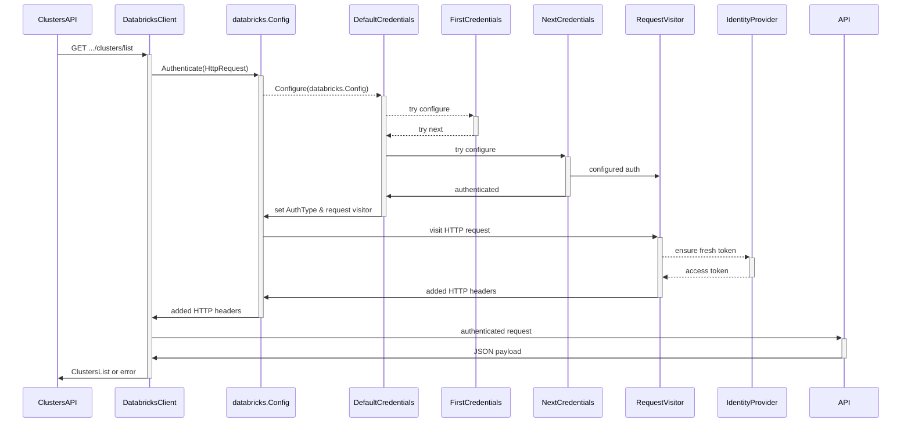
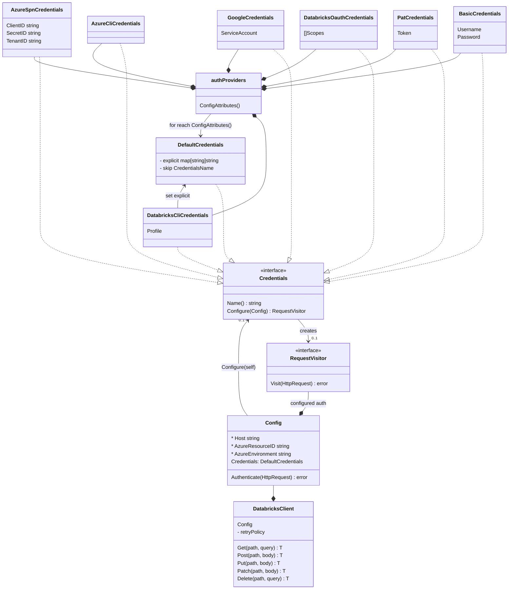

Databricks SDK for Go
---

Initial commit includes porting of Core Authentication layer.

## High level auth flow

## Almost ideal design

TODO:
---

- [ ] change origin to the databricks-sdk-go
- [ ] Azure MSI Auth ported
- [ ] Try pulling up packages for Azure and Google
- [ ] Pass tests for CommonEnvironmentClient
- [ ] CommandFactory should be done better
- [ ] Propagate optional key-value pairs to user agent
- [ ] Propagate OS as default key-value pair to user agent
- [ ] Get rid of Terraform SDK leftovers
- [ ] Mention contributors from Terraform provider side
- [ ] Support Databricks OAuth
- [ ] Record configFixture{} compliance test JSON
- [ ] Activate custom path visitor for clients where AccountID is set for Accounts API
- [ ] Provide error explanation callback, so that terraform plugin could include documentation, based on context.
- [ ] figure out if we should replace go-retryablehttp (MPL 2.0) with own impl, or something close to vendor/cloud.google.com/go/compute/metadata/retry.go

Mono-packages & spirit:

- [ ] single shipping vehicle per language
- [ ] Databricks Runtime should eventually include Python SDK by default
- [ ] python sdk -> SDK
- [ ] discoverability
- [ ] clean delineation
- [ ] convenience
- [ ] door for opening packages later
- [ ] easy explanation of purpose
- [ ] pulling in dependencies
- [ ] make it very clear
- [ ] add OWNERS approval on go.mod/setup.py changes (well... dependabot?...)
