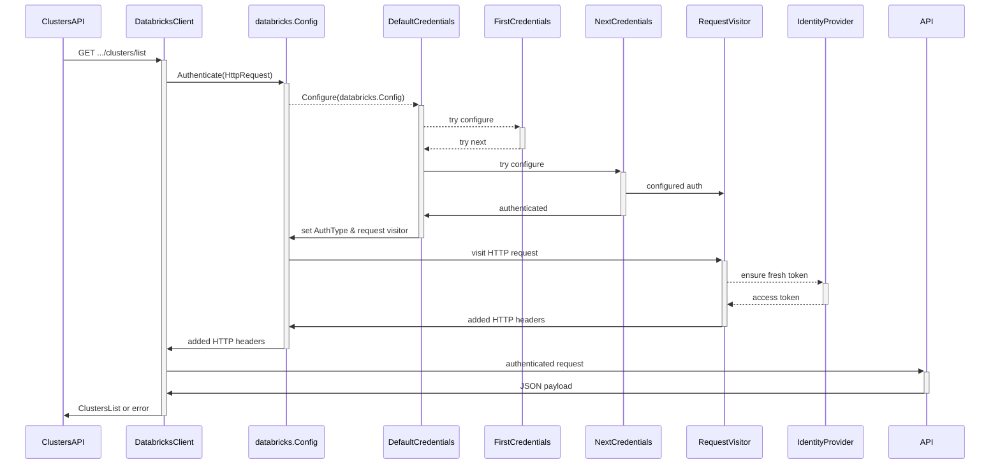
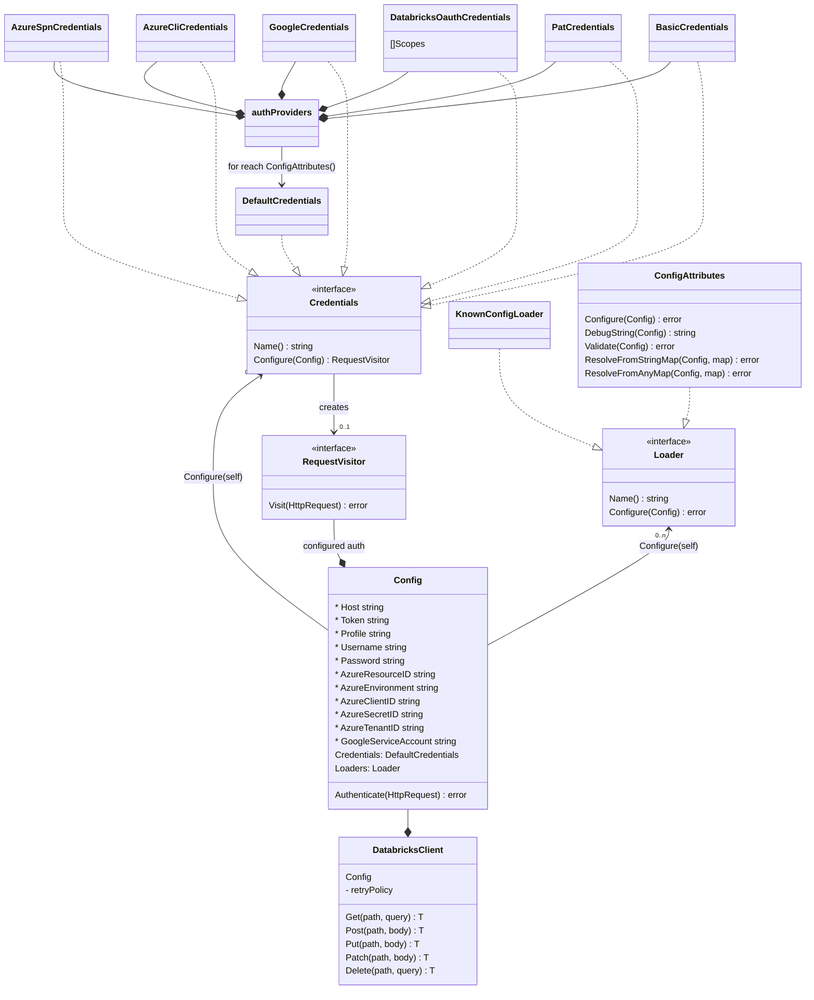

Authentication
---

## Auth flow

```mermaid
sequenceDiagram
    ClustersAPI->>+DatabricksClient: GET .../clusters/list
    DatabricksClient->>+databricks.Config: Authenticate(HttpRequest)

    databricks.Config-->>+DefaultCredentials: Configure(databricks.Config)
    DefaultCredentials-->>+FirstCredentials: try configure
    FirstCredentials-->>-DefaultCredentials: try next
    DefaultCredentials->>+NextCredentials: try configure
    NextCredentials->>RequestVisitor: configured auth
    NextCredentials->>-DefaultCredentials: authenticated
    DefaultCredentials->>-databricks.Config: set AuthType & request visitor

    databricks.Config->>+RequestVisitor: visit HTTP request
    RequestVisitor-->>+IdentityProvider: ensure fresh token
    IdentityProvider-->>-RequestVisitor: access token
    RequestVisitor->>-databricks.Config: added HTTP headers
    
    databricks.Config->>-DatabricksClient: added HTTP headers

    DatabricksClient->>+API: authenticated request
    API->>-DatabricksClient: JSON payload
    DatabricksClient->>-ClustersAPI: ClustersList or error
```

## Client configuration

```mermaid
classDiagram
    Loader "0..n" <-- Config: Configure(self)
    Credentials "0..1" <-- Config: Configure(self)
    RequestVisitor --* Config: configured auth
    class Config {
        * Host string
        * Token string
        * Profile string
        * Username string
        * Password string
        * AzureResourceID string
        * AzureEnvironment string
        * AzureClientID string
        * AzureSecretID string
        * AzureTenantID string
        * GoogleServiceAccount string

        Credentials: DefaultCredentials
        Loaders: Loader

        Authenticate(HttpRequest) error
    }

    class Loader {
        <<interface>>
        Name() string
        Configure(Config) error
    }

    KnownConfigLoader ..|> Loader
    class KnownConfigLoader

    ConfigAttributes ..|> Loader
    class ConfigAttributes {
        Configure(Config) error
        DebugString(Config) string
        Validate(Config) error
        ResolveFromStringMap(Config, map) error
        ResolveFromAnyMap(Config, map) error
    }

    Config --* DatabricksClient
    class DatabricksClient {
        Config
        - retryPolicy
        
        Get(path, query) T
        Post(path, body) T
        Put(path, body) T
        Patch(path, body) T
        Delete(path, query) T
    }

    Credentials --> "0..1" RequestVisitor: creates
    class Credentials {
        <<interface>>
        Name() string
        Configure(Config) RequestVisitor
    }

    class RequestVisitor {
        <<interface>>
        Visit(HttpRequest) error
    }

    AzureSpnCredentials --* authProviders
    AzureSpnCredentials ..|> Credentials
    class AzureSpnCredentials

    AzureCliCredentials --* authProviders
    AzureCliCredentials ..|> Credentials

    GoogleCredentials --* authProviders
    GoogleCredentials ..|> Credentials
    class GoogleCredentials
    
    DatabricksOauthCredentials --* authProviders
    DatabricksOauthCredentials ..|> Credentials
    class DatabricksOauthCredentials {
        []Scopes
    }

    PatCredentials --* authProviders
    PatCredentials ..|> Credentials
    class PatCredentials

    BasicCredentials --* authProviders
    BasicCredentials ..|> Credentials
    class BasicCredentials

    authProviders --> DefaultCredentials: for reach ConfigAttributes()
    DefaultCredentials ..|> Credentials
    class DefaultCredentials
```
